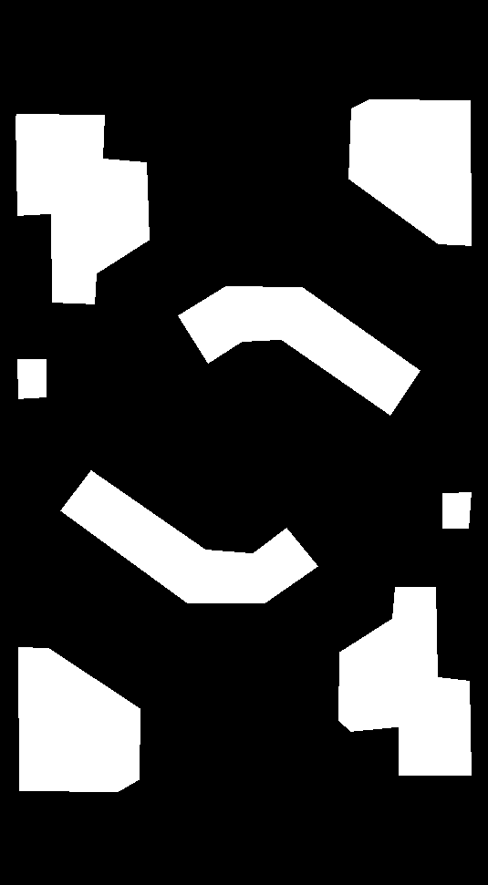

# FYT2024 国赛雷达

作者：邹承甫

## 效果演示


## 依赖

- Ubuntu 22.04
- ROS2 Humble
- 海康CS60工业相机
- 海康SDK
- ultralytics

## 简介

识别方案为常规的双层神经网络（均为YOLOv10-n），识别到机器人后扣出ROI识别装甲板。由于时间紧迫（开发时间约3天），所用数据集100%为华南农业大学开源数据集。

该雷达采用单目透视变换方案，设置了两个透视平面，如下面mask所示，白色为高地平面，黑色为地面平面。在识别到机器人后，根据机器人所处平面，使用对应的变换矩阵获取地图坐标。



## 使用方法

### 1. 与裁判系统建立通信

使用usb转ttl设备（CH341或者CH340）连接你的电脑和电源管理，将设备名绑定为/dev/ttyReferee，见文章(Linux 绑定USB设备端口)[https://blog.csdn.net/m0_38144614/article/details/121297159]

### 2. 启动程序

```bash
source install/setup.bash
ros2 launch radar_bringup bringup.launch.py
```

### 3. 平面标定

标定分为三个环节，分别为:
  - 初始四点标定 (INIT)
  - 精细标定 (CALIBRATING)
  - 高度确定（PLANAR_MOVING）
  
进入程序后如下图所示


拖动四个红点至正确的位置，看白色轮廓是否跟实际赛场重合（注意是高地平面），如下图所示


如果没问题，可以按`C`进入精细标定模式，这时图片会重投影回若干个绿色的点，你可以调整这些重投影点的位置至正确的地方，
最终投影矩阵会用所有点计算，取平均值

> 如果轮廓本身很吻合，可以直接跳过这一步


按`V`进入高度确定模式，这时候你可以拖拽黄色点，这时出现第二个平面（地面平面）。拖拽至第二个平面也与场地吻合，可以以环高下平面为基准，如下图所示。


这个时候定位就正常工作了，在任意时刻你都可以按`R`重新开始标定

## 关于适配新赛场或者选取不同的关键点

关键点全部位于`radar_calibrator/src/calibrator_widget.cpp`的`key_points`变量中，他们的数值是`radar_calibrator/resources/map_contours.png`中该点的对应图像坐标。

其中第一步的四个点就是下标0、1、2、3的点，这四个点是最重要的，必须选取为相机中能看到的确定位置的点，这样场上标定就会快很多。剩下的点就是第二步中会重投影出现的绿色点，他们不是很重要，选取一些明显的角点即可，选取哪里都可以。实际上比赛中只要第一步拖得好，完全不需要第二步的绿点。

如果下赛季换地图了，或者用老地图做测试，你需要修改map_contours、map_colorful文件和key_points变量。map_contours可以通过Canny或者其他边缘检测算法得到。